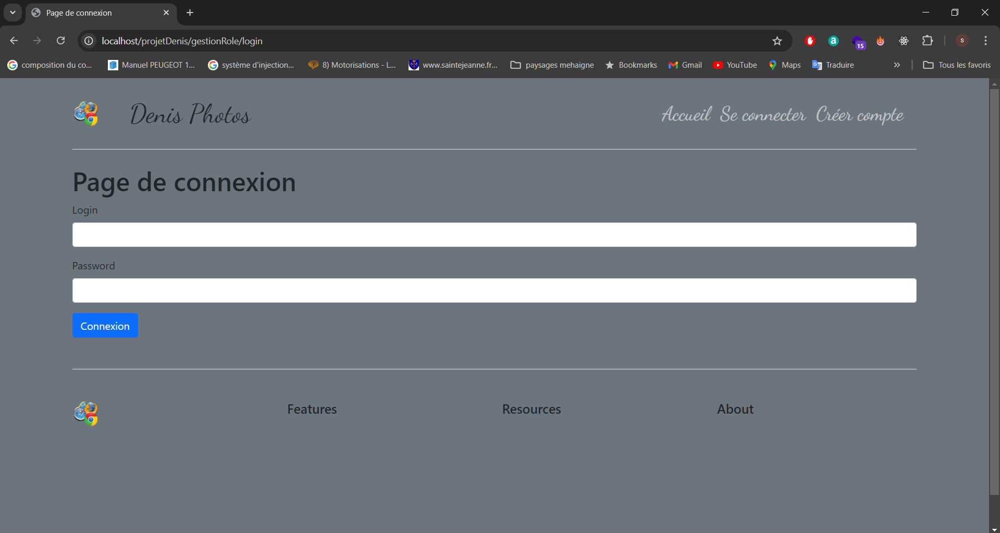

# API PHP - Architecture MVC

## Table des matières

- [Description](#description)
- [Installation](#installation)
- [Architecture](#architecture)
  - [Contrôleurs](#contrôleurs)
  - [Modèles](#modèles)
  - [Vues](#vues)
- [Sécurité](#sécurité)
- [Fonctionnalités](#fonctionnalités)
- [Gestion des erreurs](#gestion-des-erreurs)
- [Contribuer](#contribuer)
- [Licence](#licence)

---

## Description

Cette API est construite en PHP en suivant l'architecture **MVC** (Modèle-Vue-Contrôleur). Elle permet la gestion des utilisateurs, des droits administratifs et inclut des fonctionnalités de connexion, création de compte, et gestion des profils. Cette structure modulaire assure une séparation claire des responsabilités tout en offrant une gestion sécurisée des sessions, des rôles et des erreurs.



## Installation

1. **Prérequis :**
   - PHP 7.x ou supérieur
   - Serveur Apache (ou tout autre serveur compatible avec PHP)
   - Base de données MySQL (ou autre SGBD compatible avec PDO)
   - Composer (si des dépendances tierces sont nécessaires)

2. **Cloner le projet :**

   ```bash
   git clone https://github.com/ton-utilisateur/ton-repo.git
   ```

3. **Configurer la base de données :**

   - Importer le fichier SQL (si fourni) pour créer les tables nécessaires.
   - Modifier le fichier de configuration pour ajouter les paramètres de connexion à la base de données dans le fichier `/config/database.php`.

4. **Installer les dépendances (si applicable) :**

   ```bash
   composer install
   ```

5. **Configurer le serveur :**
   
   Assurez-vous que votre serveur web pointe vers le répertoire racine du projet, et configurez les règles de réécriture si vous utilisez un `.htaccess` pour la gestion des URLs "propres".

## Architecture

### Contrôleurs

Les **contrôleurs** gèrent les requêtes utilisateurs, appellent les modèles pour interagir avec la base de données et renvoient des vues pour l'affichage des informations.

Les principaux contrôleurs sont :

- **MainController** : Contrôleur abstrait de base, utilisé pour centraliser les fonctions communes telles que la génération de page et la gestion des erreurs.
  
- **VisiteurController** : Gère les pages accessibles aux visiteurs non connectés (accueil, connexion, création de compte).

- **UtilisateurController** : Gère les fonctionnalités liées aux utilisateurs connectés, telles que la gestion du profil, modification des informations de compte et déconnexion.

- **AdministrateurController** : Spécifique à la gestion des utilisateurs et des droits pour les administrateurs. Permet la modification des rôles des utilisateurs.

### Modèles

Les **modèles** sont responsables de la gestion des données. Ils interagissent avec la base de données pour exécuter les opérations CRUD.

Chaque entité a son propre modèle, par exemple :

- **UtilisateurManager** : Gère les interactions liées aux utilisateurs (connexion, création de compte, modification de profil).
- **AdministrateurManager** : Gère les droits d'administration et les utilisateurs pour les administrateurs.

### Vues

Les **vues** sont responsables de l'affichage. Les contrôleurs fournissent les données nécessaires aux vues via des tableaux associatifs.

Les vues se trouvent dans le dossier `views/` et sont organisées par fonctionnalité :

- **Visiteur** : Contient les pages pour l'accueil, la connexion, et la création de compte.
- **Utilisateur** : Pages liées au profil utilisateur, modification du mot de passe, etc.
- **Administrateur** : Pages liées à la gestion des droits et des utilisateurs.

### Sécurité

Le système inclut une gestion avancée de la sécurité via :

- **Securite** : Une classe dédiée à la gestion de la sécurité des sessions et des cookies.
   - Vérification des rôles utilisateur (utilisateur simple ou administrateur).
   - Protection contre les attaques XSS avec la méthode `Securite::secureHTML()`.
   - Génération de cookies sécurisés pour la gestion des sessions avec `Securite::genererCookieConnexion()`.

- **Protection des mots de passe** : Les mots de passe sont hachés via `password_hash()` et vérifiés avec `password_verify()`.

### Fonctionnalités

- **Connexion et déconnexion**
- **Création de compte avec validation par email**
- **Gestion des profils utilisateur** (modification de l'email, du mot de passe, et de l'image de profil)
- **Gestion des droits administratifs** : Modification des rôles des utilisateurs (admin/utilisateur)
- **Téléchargement et validation d'images** (via `Toolbox::ajoutImage()`)
- **Système d'alertes** : Utilisation de la classe `Toolbox` pour afficher des messages d'erreur ou de succès.

### Gestion des erreurs

Les erreurs sont gérées de manière centralisée via la méthode `MainController::pageErreur()`. Cette méthode permet de générer une page d'erreur avec un message personnalisé en fonction de la situation.

Les contrôleurs spécifiques (par ex. `UtilisateurController`, `AdministrateurController`) héritent de cette fonctionnalité pour traiter les erreurs liées à leurs domaines respectifs.

### Exemples d'utilisation

#### Exemple 1 : Connexion utilisateur

1. L'utilisateur saisit son login et mot de passe.
2. Le contrôleur `UtilisateurController` valide les informations via le modèle `UtilisateurManager`.
3. Si la combinaison est valide, une session est créée, et un cookie sécurisé est généré.
4. L'utilisateur est redirigé vers la page de son profil.

#### Exemple 2 : Modification de l'image de profil

1. L'utilisateur télécharge une nouvelle image de profil.
2. La méthode `Toolbox::ajoutImage()` vérifie la validité du fichier (extension, taille, etc.).
3. Si tout est correct, l'image est stockée dans le répertoire approprié, et l'ancienne image est supprimée.

## Contribuer

Les contributions sont les bienvenues ! Suivez ces étapes pour contribuer :

1. Forkez le dépôt.
2. Créez une branche spécifique : `git checkout -b ma-nouvelle-fonctionnalite`.
3. Apportez vos modifications et faites un commit : `git commit -m 'Ajout d'une nouvelle fonctionnalité'`.
4. Poussez vos modifications : `git push origin ma-nouvelle-fonctionnalite`.
5. Créez une Pull Request.

## Licence

Ce projet est sous licence MIT. Consultez le fichier [LICENSE](LICENSE) pour plus d'informations.
